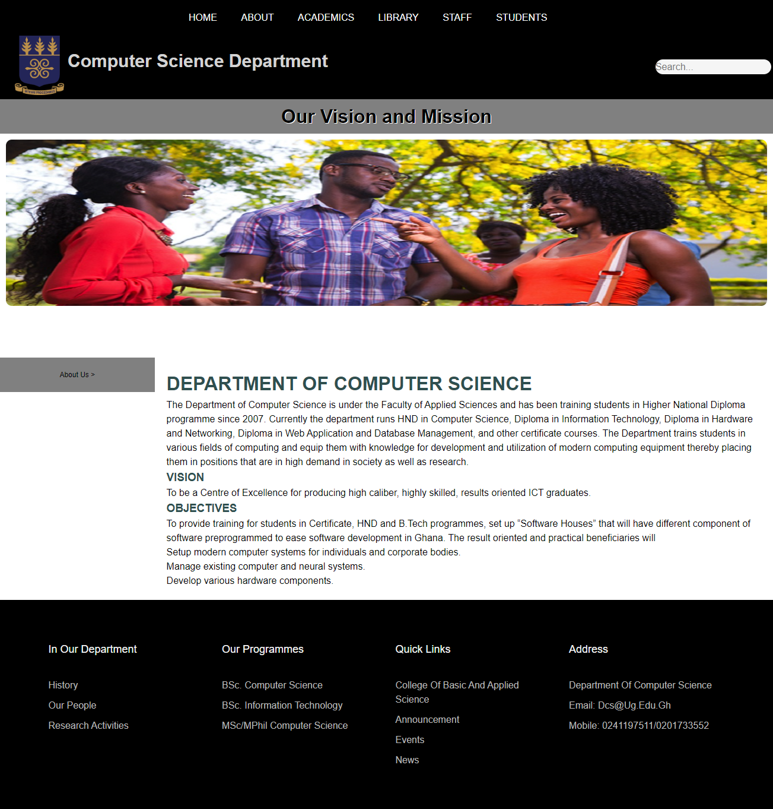

11210385
# DCIT_205_IA

# Computer Science Department Website

## Introduction

Welcome to the official website of the Computer Science Department! This platform serves as a central location for information about our department which includes courses, faculty details, and key information, events and announcements.

## Purpose

The major goal of this website is to provide a user-friendly interface for students, staff, and visitors seeking information on the Department of Computer Science. Whether you're looking for course information, faculty biographies, or news, you'll find it all here.

## Setup Instructions
1. **Clone the repository**
    ```bash
    git clone https://github.com/doreen09/11210385_DCIT205

2. **Navigate to the Project Directory:**
    cd your-repo

3. **Install Dependencies**
    npw install

4. **Run the Application:**
    npw 

## Author
Doreen Owireduaa Amankwah
11210385

## Screenshots
Homepage


About page


Academics page


Handbook Page


Library Policies Page


Library Section Page


Staff Page


Students Page


University Policies


Vision


Vice Chancellor


## Lessons Learnt
Overall, the CS Department Website project has been instrumental in broadening my technical skill set, strengthening my problem-solving abilities, and providing hands-on experience in web development best practices. The lessons I have learned will undoubtedly contribute to my growth as a developer and empower me to take on future projects with confidence and expertise.


